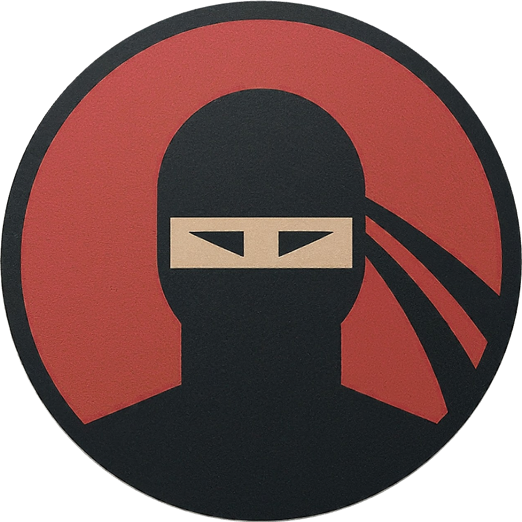

# Hanzi Hero: Empowering Kids to Master Chinese Characters - Deployment to Streamlit Cloud  

 <H3> By Jayme Zhang 

  
## Introduction

This repository showcases the deployment of the Hanzi Hero model on Streamlit Cloud. This allows users to experience the model's capabilities through a web application. It can be accessed via this [link](https://hanzi-hero.streamlit.app/): https://hanzi-hero.streamlit.app/.

More details on the processes and codes needed to build the image recognition model are documented in the [Hanzi Hero repository](https://github.com/jaymezhangjy/hanzi_hero).

## User Experience Walkthrough

A short clip of the entire user experience can be viewed below:

1. Firstly, parents can upload an image of their child's Chinese spelling list.  
2. The Chinese characters will be extracted and displayed, and parents can select the words to be tested for this session with the use of checkboxes.
3. When the selection is done, parents may click a button to proceed to the next stage for their child to start the session.
4. The child can play the pronunciation of the word, and write their answer in the canvas space provided. Options to download, undo, redo or clear the entire canvas are provided.
5. When they are ready to submit, they can check their answer to see if it is correct. Multiple attempts are allowed until they get the correct answer.
6. At any point in time, they can scroll down to move on to the next question.

## Limitations and Improvements

It is important to note that the model is currently trained only on 14 single Chinese characters indicated in this [sample spelling list](sample_spelling_lists/P1_week_6_spelling_list.png) obtained from a local MOE school's [website](https://www.punggolcovepri.moe.edu.sg/for-parents/Subject-Downloads/mother-tongue-spelling-list/). For the model to be adequately functional for the PSLE level, we would require a minimum of 1,200 Chinese characters. For a basic command of the language for daily usage, we would need the model to be trained on between 2,000 to 3,000 Chinese characters.  
  
Also, there will also be multiple Chinese characters with the same pronunciation. We would need to further improve the model such that it is able to recognise vocabulary and idioms of at least 2 characters.    
  
We also noticed that the model is unable to provide the correct prediction when we deliberately added or missed a few strokes for the Chinese character. We would need to improve the precision of the model by training it on a larger dataset of Chinese characters with printed handwritings which are more similar to children's handwritings, rather than cursive ones. Moreover, the dataset that it was trained on was obtained from adults, and most would have developed their unique writing style by then.  
  
As we deployed this model to Streamlit Cloud, we also faced challenges with regards to the compatibility of the OCR package used for Chinese character recognition and the Streamlit platform. This would related to Step 2 in the above User Experience Walkthrough. As such, this current version of Streamlit is also developed based on the same 14 single Chinese characters as mentioned above.

## Conclusion

Despite some limitations, this project serves as a successful proof-of-concept. Addressing these limitations and incorporating further improvements, as previously discussed, will unlock the project's full potential and create a truly robust and refined model.